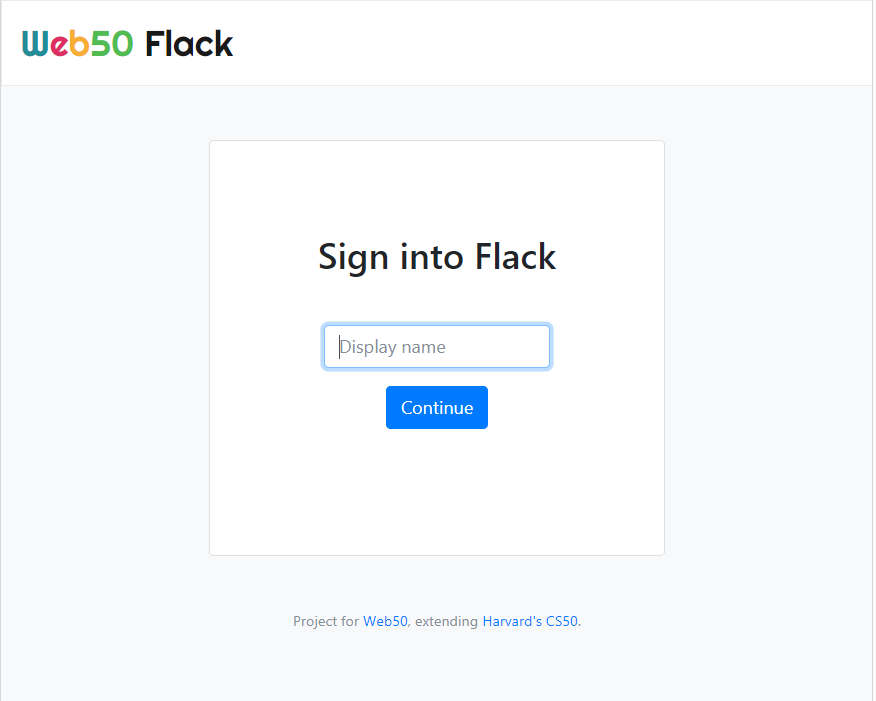
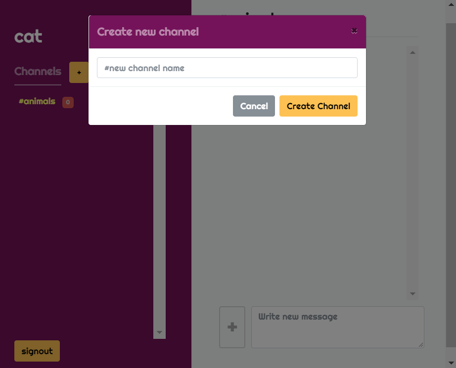
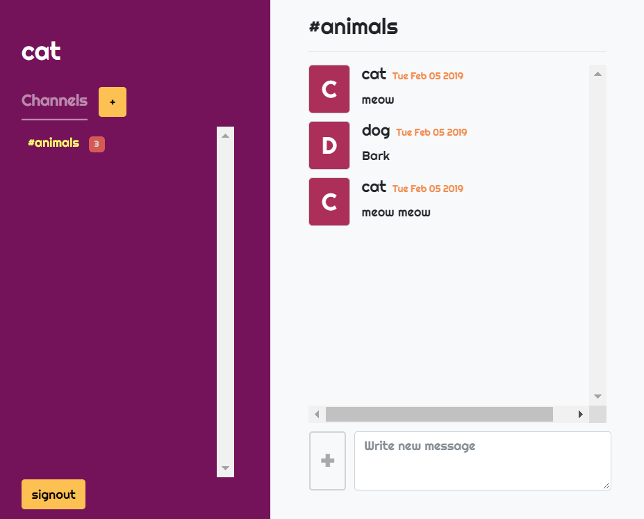

# Flack :speech_balloon:
> Practicing JavaScript, ajax and websockets in particular, to run single page application.

> Ajax와 웹소켓을 중심으로 자바스크립트를 연습하기 위한 싱글 페이지 웹 애플리케이션 개발.

## :speech_balloon: Online Messaging Service
- For CS50 Web Programming with Python and JavaScript - project 2.
- Created an online messaging service similiar to Slack.
- Used Python and `Flask` as the server framework.

| /signin | /newchannel |
:-------------------------:|:-------------------------:
 | 
| user can sign in | user can create new channel |

| /channel |
:-------------------------:|
 |
| user can send text messages in real-time within a channel |

- Utilized __different methods of connnection__ between client and server:
  1) In general, `GET & POST requests and responses` (defined in application.py).
     - the javascript function for creating a new channel is not ajax (even though the action is defined in javascript, it is the same as creating a form in html; it submits a form via POST request and then the server sends a response to render the entire page. The function is merely defined in javascript because the form would have to encompass a large portion in the channel.html file if it were to be in the html file.)
  2) `Websockets` for posting new messages in order for persistent connection (because making request everytime is inefficient) and broadcasting messages to all users.
  3) `Ajax` for changing channels so that the sidebar remains the same while only the main content part is modified. (Websockets have problem with blockages and ajax is simplier for rest apis)
- For the purpose of focusing on practicing javascript, channels and messages are stored as global variables instead of in databases. For this reason, they will be initialized every time the server restarts.

## :speech_balloon: 온라인 메세지 서비스
- 하버드의 CS50 MOOC(edX)의 Web Programming with Python and JavaScript 수업의 프로젝트 2.
- Slack과 유사한 온라인 메세지 서비스를 개발.
- Python과 `Flask`를 서버 프레임워크로 사용함.
- 서버와 클라이언트 간 다양한 네트워크 연결을 사용함:
  1. 전반적으로 `GET와 POST request와 Response를 사용`함.
     - 새 채널을 추가하는 기능은 ajax가 아닌 post request에 해당함. (HTML 파일에서 Form을 적용하기보다 자바스크립트 파일에 정의하는 것이 효율적이어서 자바스크립트로 HTML form을 만들어 post request를 보내는 방식을 선택함)
  2. 실시간으로 메세지를 전송하기 위해 `웹소켓`을 사용함. (지속적인 연결과 다수의 클라이언트에게 방송을 보내는데 효율적)
  3. 채널을 바꿀 때 사이드바를 제외한 콘텐츠만 바뀌기 위해 `Ajax`를 사용함.
- 자바스크립트에 집중하기 위한 목적으로 채널과 메세지는 데이터베이스가 아닌 파이썬 서버 내의 범용 변수로 정의되어 있음. 그렇기 때문에 서버가 재시작할 때마다 초기화됨.

## :seedling: what I learned | 무엇을 배웠는가
> This was a bit challenging project because I had to learn and implement http request-responses, ajax, and websockets all together. 

> However, I have learned a lot. Particularly, I learned the importance of implementing an __efficient workflow__ and the __difference between REST (http request-responses, ajax; half-duplex) and Websockets (full-duplex)__ and when to implement them. 

> Now, I am starting to feel limited by Flask and think I should move on to a more sophisticated framework for more complex applications.

- learned that it is important to _create an ordered list of things to do_ so that the workflow is more efficient and I am not wasting a lot of time contemplating on what I should do next. 
-> create the ordered list based on the steps the _user interface should flow_.
    - ex. (login -> access channel page/choose channel -> display messages accordingly -> write message -> post message via ajax -> and so)
- starting to think _maybe it is better to just implement css (using grids and flexboxes) instead of using templates_ like bootstrap since I have to modify them.
- learned the importance of _css specificity_. Since id has more specificity/priority over class, id in parent elements can override class in child elements. So best to use classes in general than ids. If necessary use !important.
- learned that functions assigned to variables are not hoisted. That is, _const name = () => {}_ must come before it is called.
> learned the __differences between http requests-responses, ajax, and websockets__:
1) __HTTP request-responses__ is the most general and easiest way to communication between client and server (_one-way_). The client sends a request (maybe with some data associated) and the server sends back a response. Ususally, a page is sent back and rendered.
    - On the simplest level, the html file and server code consists this kind of communication. However, Javascript may also be used to send a GET or POST request. For example, you can create a form and send it to the server using Javascript but this is does not mean it is ajax (the method is exactly the same with send a form from the html file).
2) __Ajax__ is an _asynchronous method of communication_ and is coded via _Javascript only_. The method is the same with http request-responses between client and server (_one-way_) but just asynchronous. The differences between the two can be found in that ajax only modifies parts of the page instead of the entire page and thus, does not need to refresh to see modifications. Also in the case of ajax, the server usually sends back data (_json_) instead of a page.
3) __Websockets__ is a different kind of model which provides a _persistent and bi-directional communication_ (_full-duplex communication_) and thus, is efficient for _real-time communication_ like messaging and chatting. Especially, websockets are useful for _broadcasting data to all_ users. Websockets _can also be used to asynchronously modify the pages_.
+ it is okay to use ajax and websockets together. Use them in difference cases where they will be efficiently uses.

- addEventListener와 inline event(in js file) ex) onclick의 차이점 이해

- Quick notes about Flask-SocketIO: flask socketio session is managed differently from flask session. (it forks the Flask user session at the time the client connects to the server over Socket.IO) so any change after socketio is connected is not reflected into socketio's session. It can be thought as having separate sessions. Also emitting is not a necessity (check flask-socketio documentation for details)
